# betaquirrel-tasks

## Betasquirrel assignments

 [Click here 📙](https://stackoverflow.com/users/21194129/dote)

 

 [Click here 📙](https://www.linkedin.com/in/rakesh-mg-615168213/)

 

 Task page[Click here](https://rakesh-m-g.github.io/betaquirrel-tasks/) 👈

 

| Requrements                     | Output                  |
| ------------------------------- | ----------------------- |
| 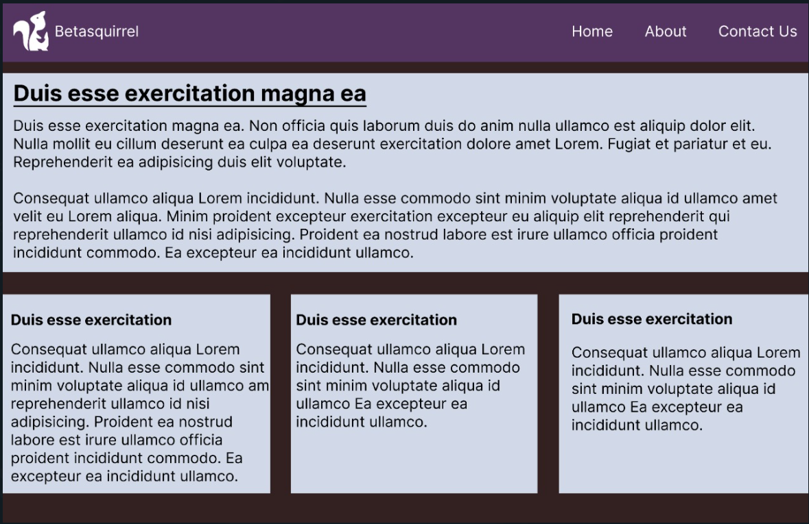 | 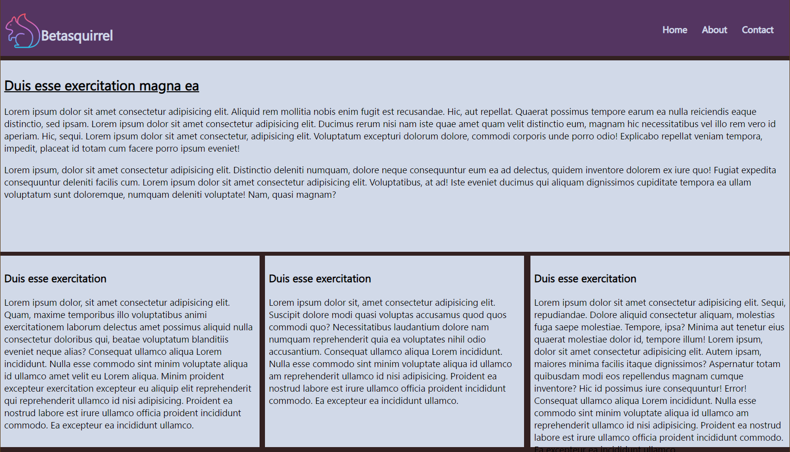 |

### **Second task**

| Requrements                     | Output                       |
| ------------------------------- | ---------------------------- |
| 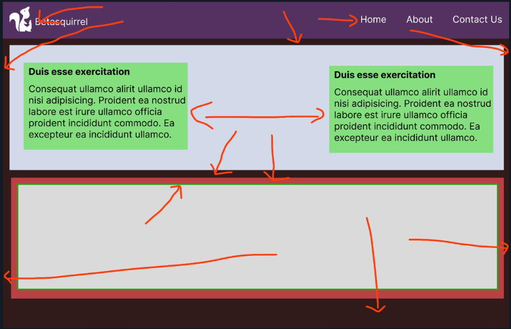 | 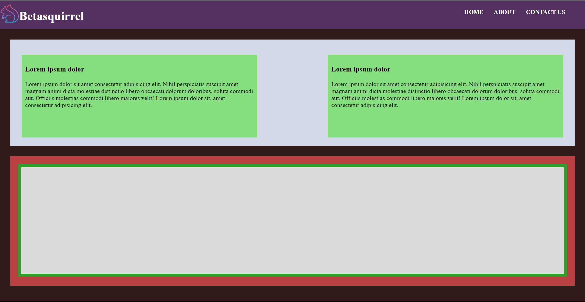 |

### **Task 3**

- [HTML Basic](https://www.w3schools.com/html/default.asp)
- [HTML Elements](https://www.w3schools.com/html/html_basic.asp)
- [html Attributes](https://www.w3schools.com/html/html_attributes.asp)
- [HTML Headings](https://www.w3schools.com/html/html_headings.asp)
- [HTML Paragraphs](https://www.w3schools.com/html/html_paragraphs.asp)
- [HTML Styles](https://www.w3schools.com/html/html_styles.asp)
- [HTML Text Formatting](https://www.w3schools.com/html/html_formatting.asp)
- [HTML Comments](https://www.w3schools.com/html/html_comments.asp)
- [HTML Colors](https://www.w3schools.com/html/html_colors.asp)
- [HTML Links](https://www.w3schools.com/html/html_links.asp)
- [HTML Images](https://www.w3schools.com/html/html_images.asp)
- [HTML Favicon](https://www.w3schools.com/html/html_favicon.asp)
- [HTML Tables](https://www.w3schools.com/html/html_tables.asp)
- [HTML Table Borders](https://www.w3schools.com/html/html_table_borders.asp)

### **Fourth task**

| Requrements                     | Output                       |
| ------------------------------- | ---------------------------- |
| 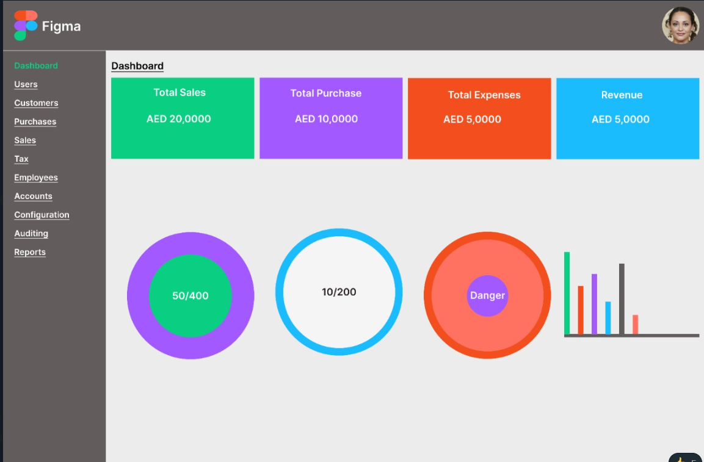 | 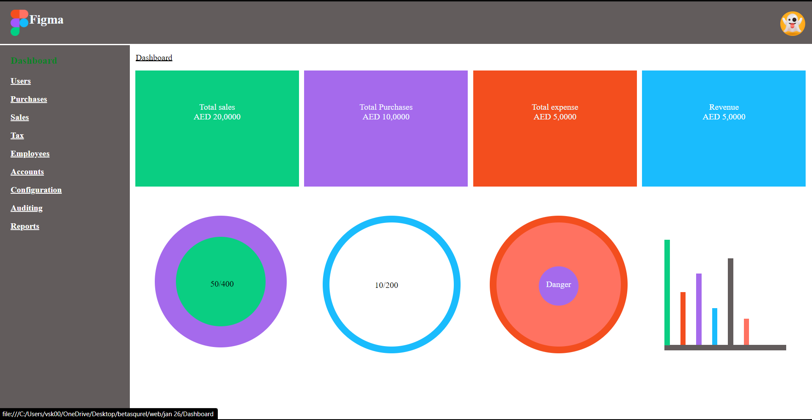 |

### **Linux Commands**

| _Commands_ |                                   | _Example_             |
| ---------- | --------------------------------- | --------------------- |
| `cd`       | Change currentdirectory           | `cd Desktop`, `cd ..` |
| `ls`       | List contents of a directory      | `ls -a`               |
| `pwd`      | Display current working directory | `pwd`                 |
| `cat`      | Display contentsof a file         | `cat README.md`       |
| `mkdir`    | create new directories            | `mkdir newFolder`     |

### **Git Commands**

| _Commands_      |                                                     | _Example_                                                       |
| --------------- | --------------------------------------------------- | --------------------------------------------------------------- |
| 1. `git config` | Configure git user                                  | `git config --global user.name "username"`                      |
| 2. `git clone`  | Clone a remorte git repo to your local              | `git clone https://github.com/rakesh-m-g/betaquirrel-tasks.git` |
| 3. `git add`    | Add your file changes to git                        | `git add .`                                                     |
| 4. `git commit` | Commit changes to git                               | `git commit -m "internal commit"`                               |
| 5. `git push`   | Push your local commits to remote repo              | `git push origin main`                                          |
| 6. `git pull`   | fetch and download content from a remote repository | `git pull <remote> `                                            |

### Task 5

- [HTML Favicon](https://www.w3schools.com/html/html_favicon.asp)
- [HTML Tables](https://www.w3schools.com/html/html_tables.asp)
- [HTML Table Borders](https://www.w3schools.com/html/html_table_borders.asp)
- [HTML Table Sizes](https://www.w3schools.com/html/html_table_sizes.asp)
- [HTML Table Headers](https://www.w3schools.com/html/html_table_headers.asp)
- [HTML Table Padding & Spacing](https://www.w3schools.com/html/html_table_padding_spacing.asp)
- [HTML Table Colspan & Rowspan](https://www.w3schools.com/html/html_table_colspan_rowspan.asp)
- [HTML Table Styling](https://www.w3schools.com/html/html_table_styling.asp)
- [HTML Table Colgroup](https://www.w3schools.com/html/html_table_colgroup.asp)

### **Task 6**

| PC view indexpage                 | pc view student page                | index page mobile view          | student page mobile view          |
| --------------------------------- | ----------------------------------- | ------------------------------- | --------------------------------- |
| 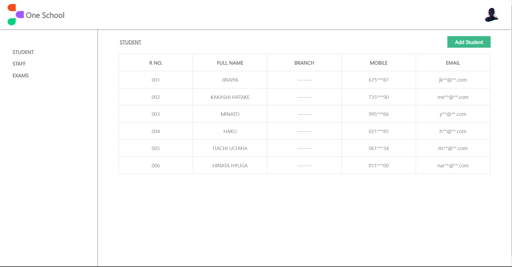 | 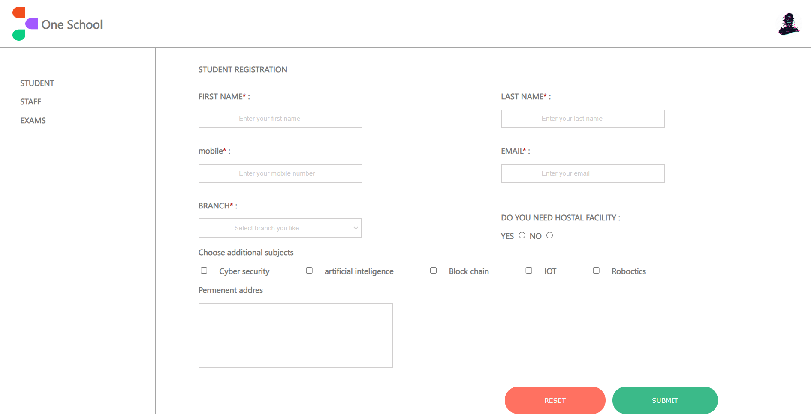 | 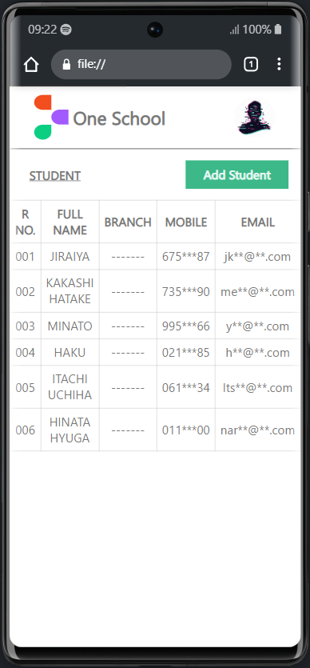 | 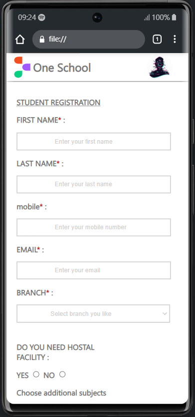 |

###**Task 7**

- 👉 new figma page[Click here](https://www.figma.com/proto/23Lt0RxK8bnmppv2t0aeGD/Untitled?page-id=149%3A812&node-id=149%3A2216&viewport=238%2C211%2C0.34&scaling=scale-down&starting-point-node-id=149%3A2216)

###**Task 8**

| calculater                   |
| ---------------------------- |
| 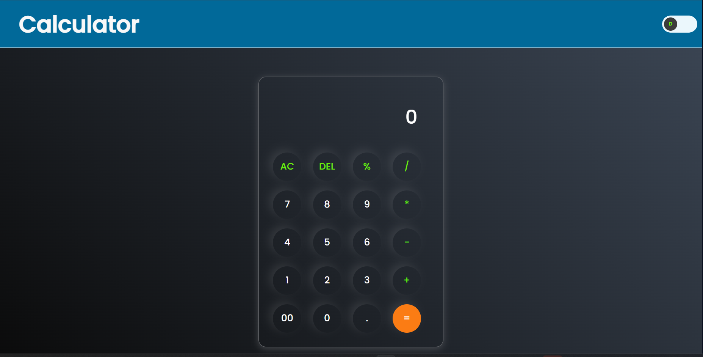 |

| 👉 This is new page[Click here](https://rakesh-m-g.github.io/betaquirrel-tasks/)  |
|-----------------------------------------------------------------------------------|
# ~~END~~
