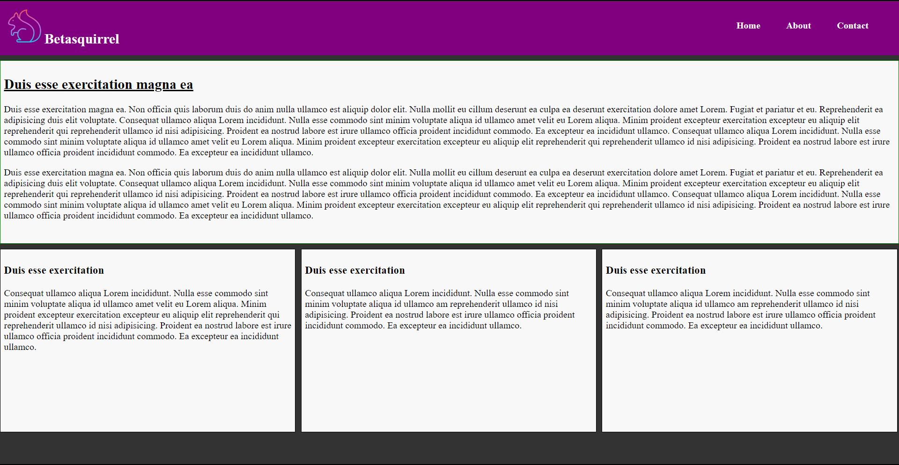

# betaquirrel-tasks

Betasquirrel assignments

| Output |
| ------ |
### **First task**
  
### **Second task**
  
  ### **Task 3**
- [HTML Basic](https://www.w3schools.com/html/default.asp)
- [HTML Elements](https://www.w3schools.com/html/html_basic.asp)
- [html Attributes](https://www.w3schools.com/html/html_attributes.asp)
- [HTML Headings](https://www.w3schools.com/html/html_headings.asp)
- [HTML Paragraphs](https://www.w3schools.com/html/html_paragraphs.asp)
- [HTML Styles](https://www.w3schools.com/html/html_styles.asp)
- [HTML Text Formatting](https://www.w3schools.com/html/html_formatting.asp)
- [HTML Comments](https://www.w3schools.com/html/html_comments.asp)
- [HTML Colors](https://www.w3schools.com/html/html_colors.asp)
- [HTML Links](https://www.w3schools.com/html/html_links.asp)
- [HTML Images](https://www.w3schools.com/html/html_images.asp)
- [HTML Favicon](https://www.w3schools.com/html/html_favicon.asp)
- [HTML Tables](https://www.w3schools.com/html/html_tables.asp)
- [HTML Table Borders](https://www.w3schools.com/html/html_table_borders.asp)
### **Fourth task**
  

 ### **Linux Commands**
| *Commands* |                        | *Example*               |
| -------- | ---------------------- | --------------------- |
| `cd`     | Change currentdirectory | `cd Desktop`, `cd ..` |
| `ls`     | List contents of a directory | `ls -a`          |
| `pwd`    | Display current working directory | `pwd`       |
| `cat`    | Display contentsof a file         | `cat README.md` |
### **Git Commands**
| *Commands* |                                   | *Example* |
| -------- | --------------------------------- | ------- |
| 1. `git config` | Configure git user         | `git config --global user.name "username"` |
| 2. `git clone` | Clone a remorte git repo to your local | `git clone https://github.com/rakesh-m-g/betaquirrel-tasks.git` |
| 3. `git add` | Add your file changes to git  | `git add .` |
| 4. `git commit` | Commit changes to git | `git commit -m "internal commit"` |
| 5. `git push` | Push your local commits to remote repo | `git push origin main` |

- - - - - - - - - - - -  # ~~END~~